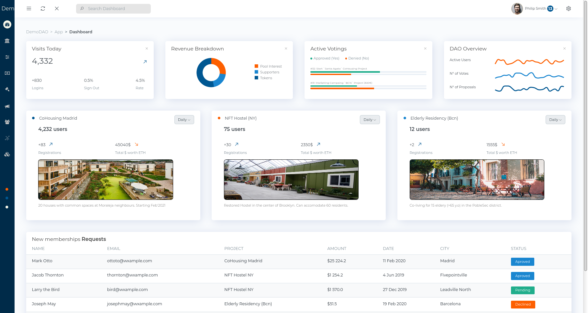

# communitas
SDG #11 Sustainable Cities and Communities Project

  

**Final Delivery**:

* Week 1, 2, 3, 4 & 5 Deliverables files
* User Personas
* Business Canvas
* Pitch Deck
* Video
* Demo Platform

**Demo Platform**:

You can check the live version of our alpha platform here: [Communitas Demo](http://communitas.netlify.com)
Also, all the code is submited in the Github repo, here: [Communitas Source Code](https://github.com/jpaulet/comunitas/tree/master/communitas)

  

## Communitas 
commūnitās is targeting the lack of individually tackle economic, social and climate change issues. The platform brings the community together in order to reach common goals by creating DAO’s to archive it.  

Though blockchain DAOs, communities could pool for a common interest. Blockchain allows users to register goals, develop their collective policies, contract specifications, pool together -use of compound interest considered- and eventually, reach that goal.  

We want to create a replicable, from global to local DAO framework in order to be able and facilitate the creation of multiple organizations where people come together to sustainability solve and improve situations in a wide range of areas.

## Team
* J.P. Aulet (@jpaulet): Blockchain developer & Smart Cities expert. Product Development & Business. 
* E.M. Martínez (@mmmnmz): Urbanist specialized in sustainability. Product Manager and Design. Business.
* C.P. Gromaches (@cgromaches): Architect specialized in sustainability. Product Manager and Design. Business.

## After the Hackathon

We plan to keep the development of the Communitas project starting with demo projects in our zone but also targetting other people to join & start building new DAOs arround the world, where people could join, fund, archieve a common goal and work together with a reliable binding contract deployed on the Blockchain & grow the project to become a new standard of project development, either for individuals, NGO's or communities. 
