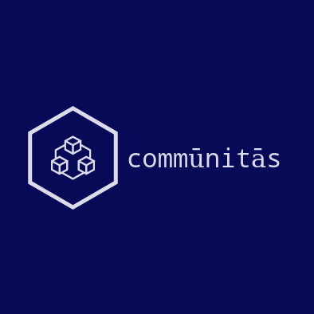

# communitas
SDG #11 Sustainable Cities and Communities Project

**Problem**:
Cities consume 80 percent of energy production worldwide and account for a roughly equal share of global greenhouse gas emissions. Many cities struggle with environmental degradation, traffic congestion, and inadequate urban infrastructure. City citizens all over the world deserve better basic services, including access to clean water, sanitation, and waste management. How do we design and build cities of the future that sustain the well-being of people, economies, and our planet? How can we breakdown the structural racism built into our economies and cities as we invest in sustainable infrastructure?

**Our Solution**:

  

## Comunitas 

commūnitās is targeting the lack of individually tackle economic, social and climate change issues. The platform brings the community together in order to reach common goals by creating DAO’s to archive it.  

Though blockchain DAOs, communities could pool for a common interest. Blockchain allows users to register goals, develop their collective policies, contract specifications, pool together -use of compound interest considered- and eventually, reach that goal.  

We want to create a replicable, from global to local DAO framework in order to be able and facilitate the creation of multiple organizations where people come together to sustainability solve and improve situations in a wide range of areas.

## Team
* J.P. Aulet (@jpaulet): Blockchain developer & Smart Cities expert. Product Development & Business. 
* E.M. Martínez (@mmmnmz): Urbanist specialized in sustainability. Product Manager and Design. Business.
* C.P. Gromaches (@cgromaches): Architect specialized in sustainability. Product Manager and Design. Business.

## Deliverables

* [Week 1](https://github.com/jpaulet/comunitas/tree/master/Week1)
* [Week 2](https://github.com/jpaulet/comunitas/tree/master/Week2)
* Week 3: TBD
* Week 4: TBD
* Week 5 & 6: TBD

## After the Hackathon

We plan to keep the development of the comunitas project starting with demo projects in our zone but also targetting other people to join & start building new DAOs arround the world, where people could join, fund, archieve a common goal and work together with a reliable binding contract deployed on the Blockchain & grow the project to become a new standard of project development, either for individuals, NGO's or communities. 
